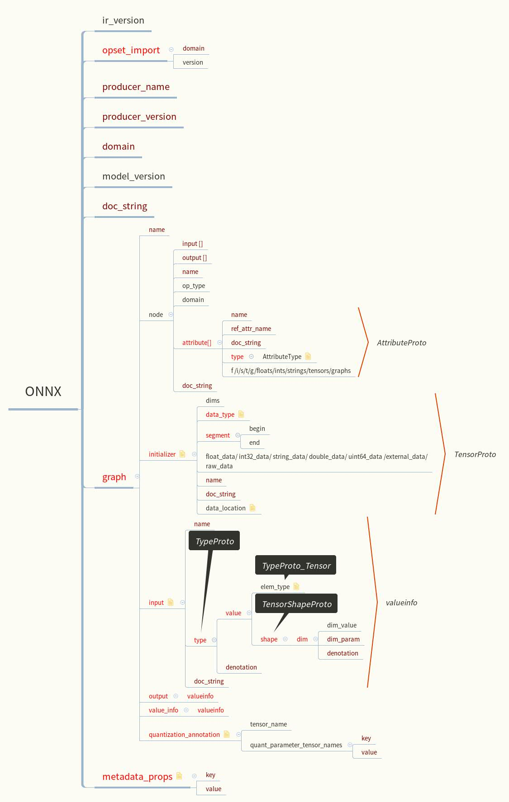

# ONNX-parser
解析ONNX  Model所有内容

### 编译命令
```
g++ main.cpp  onnx.pb.cc  /usr/local/lib/libprotobuf.a -std=c++11 -pthread -I/usr/local/include -o test
```

### 运行命令
onnxParse只打印网络结构，onnxParse_weights可打印全部参数
```
$ ./bin/onnxParse model.onnx
```

### ONNX协议解析
